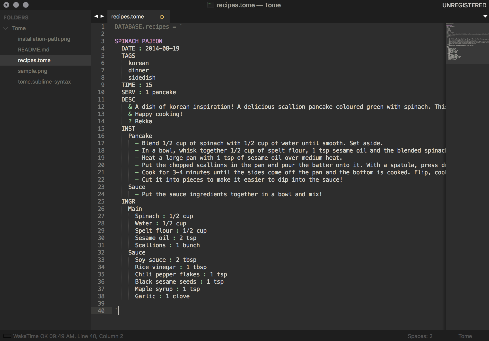
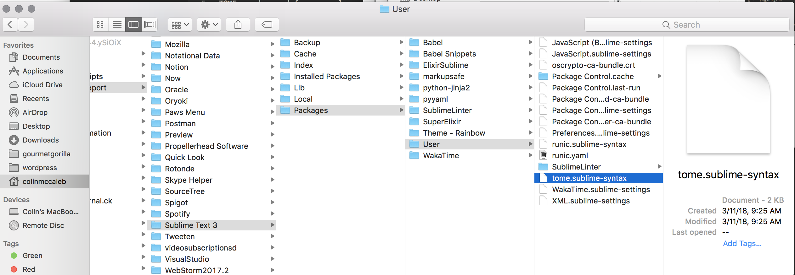

# TOME Database

TOME is a file extension for [Neauoire](https://github.com/neauoire)'s markup language [Runic](https://github.com/XXIIVV/Riven/blob/master/scripts/nodes/indental.js). Elements from hash/array database Indental have been added as well. 

TOME can be used for serverless applications to store local databases within JavaScript. The syntax highlighter for SublimeText3 included in this folder (tome.sublime-syntax) establishes visual heirarchy by identifying top level items and Runic characters.

## Preview 

## Installation
To install the syntax highlight, go to your Library(on OSX) by pressing the `Go` menu in the top menubar, while holding `alt`.
Navigate to, and add sublime file in `Application Support/SublimeText3/Packages/User/`

`Recipes.tome` is included as a sample file to illustrate the syntax highlighter. You'll need to make sure that "Tome" is selected as the file format at the bottom right of the window.

